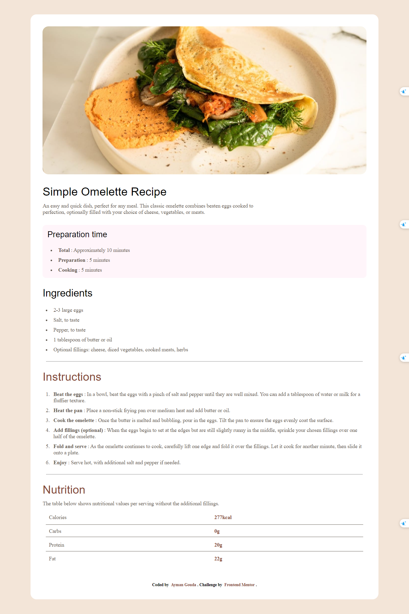
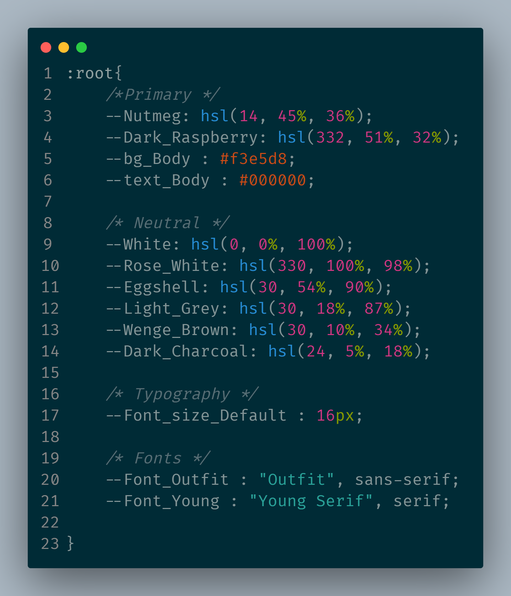

# Frontend Mentor - Recipe page solution

This is a solution to the [Recipe page challenge on Frontend Mentor](https://www.frontendmentor.io/challenges/recipe-page-KiTsR8QQKm). Frontend Mentor challenges help you improve your coding skills by building realistic projects. 

## Table of contents

- [Overview](#overview)
  - [Screenshot](#screenshot)
  - [Links](#links)
- [My process](#my-process)
  - [Built with](#built-with)
  - [What I learned](#what-i-learned)
- [Author](#author)

**Note: Delete this note and update the table of contents based on what sections you keep.**

## Overview

### Screenshot



Add a screenshot of your solution. The easiest way to do this is to use Firefox to view your project, right-click the page and select "Take a Screenshot". You can choose either a full-height screenshot or a cropped one based on how long the page is. If it's very long, it might be best to crop it.

Alternatively, you can use a tool like [FireShot](https://getfireshot.com/) to take the screenshot. FireShot has a free option, so you don't need to purchase it. 

Then crop/optimize/edit your image however you like, add it to your project, and update the file path in the image above.

**Note: Delete this note and the paragraphs above when you add your screenshot. If you prefer not to add a screenshot, feel free to remove this entire section.**

### Links

- Solution URL: [Add solution URL here](https://your-solution-url.com)
- Live Site URL: [Add live site URL here]()

## My process

### Built with

- Semantic HTML5 markup
- CSS custom properties
- Flexbox
- Responsive

**Note: These are just examples. Delete this note and replace the list above with your own choices**

### What I learned

#Adjust the entire page to the same size

#Makes it responsive to all screens while maintaining precise distances and sizes

To see how you can add code snippets, see below:

```css

:root{
    /*Primary */
    --Nutmeg: hsl(14, 45%, 36%);
    --Dark_Raspberry: hsl(332, 51%, 32%);
    --bg_Body : #f3e5d8;
    --text_Body : #000000;

    /* Neutral */
    --White: hsl(0, 0%, 100%);
    --Rose_White: hsl(330, 100%, 98%);
    --Eggshell: hsl(30, 54%, 90%);
    --Light_Grey: hsl(30, 18%, 87%);
    --Wenge_Brown: hsl(30, 10%, 34%);
    --Dark_Charcoal: hsl(24, 5%, 18%);
    
    /* Typography */
    --Font_size_Default : 16px;
    
    /* Fonts */
    --Font_Outfit : "Outfit", sans-serif;
    --Font_Young : "Young Serif", serif;
}

```



**Note: Delete this note and replace the list above with resources that helped you during the challenge. These could come in handy for anyone viewing your solution or for yourself when you look back on this project in the future.**

## Author

- Website - [Ayman Gouda](https://portofolie-6e19.onrender.com)
- Frontend Mentor - [@Ayman98-art](https://frontendmentor.io/profile/Ayman98-art)
- Twitter - [none]()

**Note: Delete this note and add/remove/edit lines above based on what links you'd like to share.**
